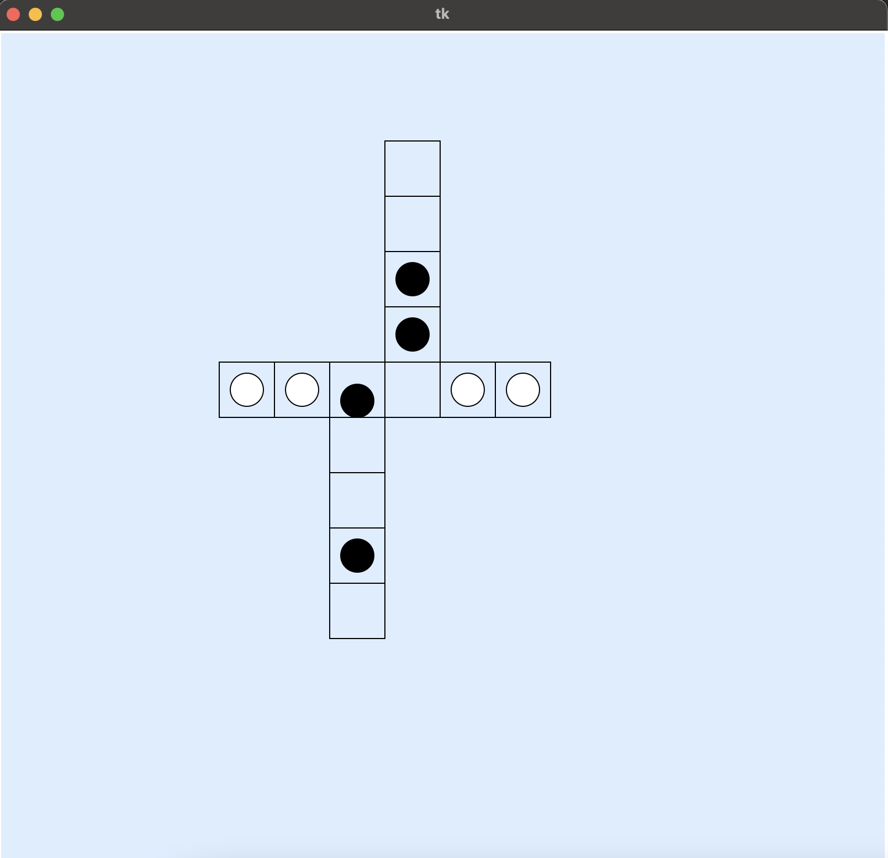

# Coin Puzzle (Slab)
Coin puzzle sample program and animation generator.
You can see how coins are moved visually.

## Requirements
- Python
	- tk
	
## Usage
Run ```make``` to compile and run main.
Then coin moving animation will start.

### Capture

